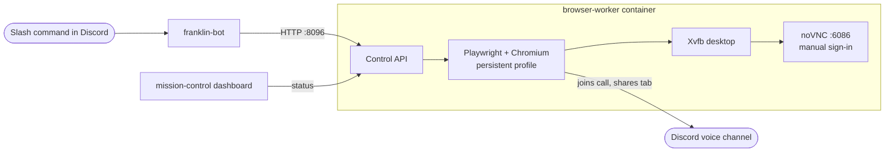

# Franklin Broadcast

Discord slash commands that put a video in front of a voice call. `/s-start <url>` tells a
persistent browser worker to join the call, open the video, and share the tab with audio.
`/s-swap`, `/s-play`, `/s-pause`, `/s-speed`, and `/s-stop` control it from there.

Franklin, my home-server agent, orchestrates the stream but never is the streaming identity. The
worker signs in to Discord as its own account in a real browser profile, so no user token goes in
any config file.

## Why

Discord bots can't screen-share. Watching something together meant one person sharing their own
screen and tying up their machine for the whole call. This moves that job to a container on a
server: it stays signed in and keeps the media tab focused, and anyone in the channel with the bot
can start, swap, or stop the stream.

## How it works

| Directory | What it is |
|---|---|
| `browser-worker/` | Chromium driven by Playwright on an Xvfb desktop, noVNC for manual control, and the control API (`/health`, `/status`, `/stream/start`, `/stream/swap`, `/stream/play`, `/stream/pause`, `/stream/speed`, `/stream/stop`) |
| `franklin-bot/` | The Discord bot: the `/s-*` stream commands plus chat, voice (`/join`, `/ask`, `/say`), and status commands backed by a local LLM, STT, and TTS |
| `mission-control/` | A dashboard card that shows the worker's state |
| `deploy/` | An example compose file, a systemd unit, and `.env.example` |

The worker runs with 4 vCPU, 8 GiB RAM, and 1 GiB shared memory. An AMD render device
(`/dev/dri/renderD128`) is passed through for video decode.

## Set up

1. Build and start the worker from `browser-worker/` (`docker compose up -d --build`).
2. Restart it in manual-login mode, open `http://<host>:6086/vnc.html`, and sign the worker's
   Discord account in once. The profile persists in `./data/profile`. See
   [browser-worker/README.md](browser-worker/README.md).
3. Copy `deploy/.env.example` to `.env`, set `DISCORD_TOKEN` for the bot application, and start
   `franklin-bot/`.
4. Optional: deploy `mission-control/` and wire services with the files in `deploy/`.

## Security

**Keep this on a private network.** The control API on `:8096` and noVNC on `:6086` have no
authentication, and noVNC gives full control of a browser that is signed in to Discord. Bind them
to localhost or a Tailscale interface, or put them behind an authenticating proxy. Don't expose
them to the internet.

The live browser profile, tokens, logs, and host secrets are not in this repository.
`mission-control/` still has addresses from my own network in it; change them for yours.

## Status

This is a snapshot of a setup that runs on my home server, not a packaged product. It's shared as
a reference. It handles YouTube and Rumble URLs, including YouTube watch-page normalization.
